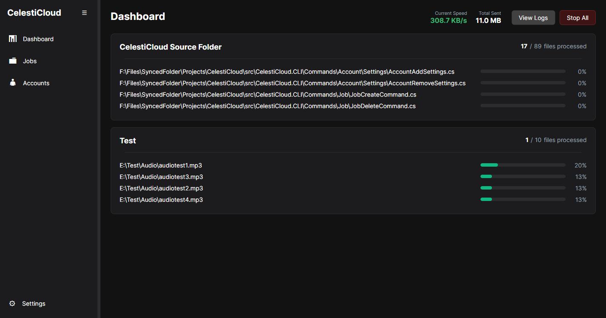
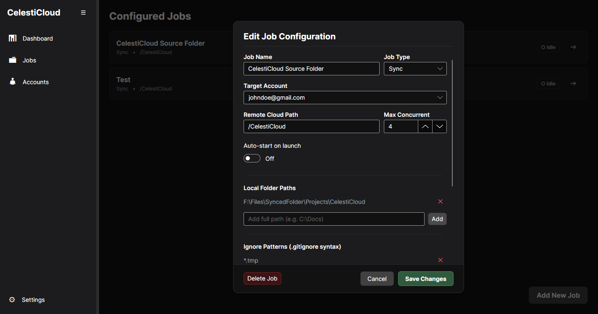
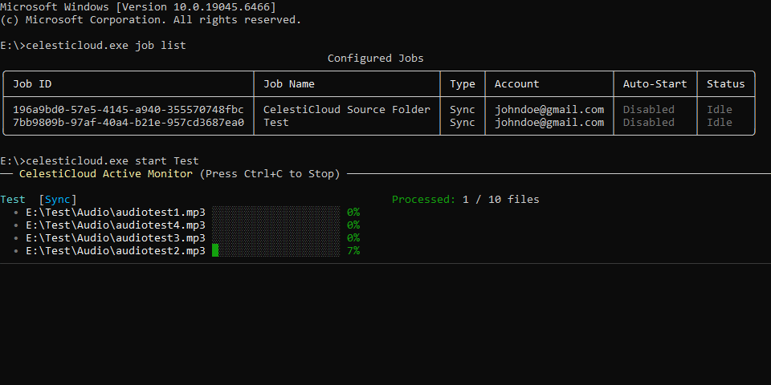

# CelestiCloud

CelestiCloud is a lightweight, cross-platform directory synchronization and backup utility built using .NET 10. It is designed to run natively on Windows, macOS, and Linux, providing both a command-line interface and a graphical user interface. 

The application utilizes direct local filesystem queries and native cloud APIs to deliver high-throughput transfers with minimal memory and CPU overhead compared to standard virtual drive clients.

---

## Screenshots

### Graphical User Interface
The desktop application features a dynamic sidebar, collapsible layout, light and dark theme switching, and a live synchronization monitor.





### Command-Line Interface
The console application offers colorized, real-time rendering of active jobs alongside verbose diagnostic logs for scripted execution environments.



---

## Core Features

* **One-Way Mirroring:** Synchronizes local edits and propagates local deletions to the cloud target.
* **Cumulative Backup:** Uploads local changes without ever deleting remote files when local copies are removed.
* **Global Rate Limiting:** Enforces strict bandwidth throttling across all active sync operations using a shared token bucket.
* **Active Concurrency:** Executes multiple file transfers in parallel using configurable thread limits.
* **Dynamic Exclusions:** Filters files in real-time during both startup scans and filesystem changes using standard .gitignore rules.
* **Process Concurrency Locks:** Utilizes OS-level process ID locking to prevent data conflicts if multiple CLI or GUI clients are run simultaneously.
* **Automatic Log Rotation:** Appends execution data to daily log files capped at 5 MB, automatically retaining the last 3 archives.

---

## Architecture and Development

CelestiCloud is built around a headless core library (`CelestiCloud.Core`) that handles configuration, execution loops, and provider integrations. Both the CLI (`CelestiCloud.CLI`) and GUI (`CelestiCloud.GUI`) projects consume this library.

The codebase leverages a modular, high-performance library stack to ensure speed and stability across platforms:

* **Exclusion Engine:** Uses the `Ignore` package within the core library to evaluate .gitignore glob and negation patterns.
* **Graphical Interface:** Built on the `Avalonia` cross-platform UI framework, using the Model-View-ViewModel (MVVM) bindings via the `CommunityToolkit.Mvvm`.
* **Command Line Interface:** Powered by `Spectre.Console`.

### Google API Scope and Verification
The application operates strictly under the `https://www.googleapis.com/auth/drive.file` scope. This security boundary ensures the application can only view, edit, or delete files and folders that were directly created by CelestiCloud, keeping your other cloud data completely isolated and secure. The client ID and secrets are undergoing official Google verification.

### Bundling Credentials
For ease of deployment, the official application binaries bundle the necessary Google API credentials internally. If you are building the application from the source, you must embed your own `credentials.json` client configuration file within the Core project assembly:

```xml
<ItemGroup>
    <EmbeddedResource Include="credentials.json" />
</ItemGroup>
```

---

## CLI Usage

The command-line interface provides clean scriptability and execution boundaries.

### Display Help Menu
To view the command routing and options:
```bash
celesticloud --help
```

### Account Management
Connect a new cloud storage account. This will automatically open an OAuth authentication screen in your default browser:
```bash
celesticloud account add google
```

List connected storage accounts:
```bash
celesticloud account list
```

Disconnect a storage account:
```bash
celesticloud account remove "user@gmail.com"
```

### Job Management
Create a job via interactive console prompts:
```bash
celesticloud job create
```

List all configured jobs and execution statuses:
```bash
celesticloud job list
```

Interactively edit an existing job:
```bash
celesticloud job edit "Work Sync"
```

### Starting Jobs
Start a specific job in the foreground:
```bash
celesticloud start "Work Sync"
```

Start a job in debug mode to output raw developer traces instead of progress meters:
```bash
celesticloud start "Work Sync" --debug
```

Concurrently execute all configured auto-start jobs in the foreground:
```bash
celesticloud job autostart
```

---

## Configuration and Log Directories

CelestiCloud stores system configurations and logs in platform-specific application data folders:

* **Windows:** `%APPDATA%\CelestiCloud\`
* **macOS:** `~/Library/Application Support/CelestiCloud/`
* **Linux:** `~/.config/CelestiCloud/`

Log files are automatically rotated daily and capped at 5 MB each, retaining a maximum of 3 historical archives to manage disk space.

---

## Contributing

This utility was developed to address personal requirements for a fast, resource-light directory mirror that operates without virtual drive layers. 

Contributions, bug reports, and improvements are highly welcome. If you find a bug or have an idea for a new feature (such as adding support for other cloud providers like Dropbox or OneDrive), please feel free to open an issue or submit a pull request.

---

## Privacy and Terms of Service

CelestiCloud is built around a local-first architecture. It operates entirely on your physical machine with no centralized servers, database tracking, or telemetry collection.

The full, legally binding policies are hosted on the official documentation page:
* **Documentation and Policies:** [https://atif85.github.io/CelestiCloud/](https://atif85.github.io/CelestiCloud/)

### Privacy Highlights
* **Zero Telemetry:** We do not collect, monitor, store, or transmit your personal data, files, configuration profiles, or analytical information.
* **Secure Token Storage:** The OAuth credentials, access tokens, and refresh tokens returned by Google are stored securely and exclusively on your local machine in the system application data directory.
* **Restricted API Access:** By requesting the restricted `drive.file` scope, the application is technically blocked from viewing, reading, or modifying any existing folders or files in your Google Drive that were not directly created by CelestiCloud.

### Terms Summary
* **Software License:** CelestiCloud is open-source software distributed under the MIT License. You are free to run, modify, and distribute the application.
* **No Warranty:** The software is provided "as is", without warranty of any kind. As with any directory-mirroring tool, users assume full responsibility for confirming that their local path targets and synchronization configurations do not conflict with or overwrite critical local data.